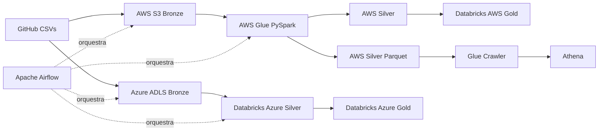

# Prompt para `/plan` no Codex
## Projeto: Apache Airflow + AWS + Azure + Databricks + Terraform + CI/CD

Quero que você atue como um **Engenheiro de Dados Sênior e Arquiteto Cloud**, mas desenvolva este projeto de forma **didática, simples, organizada e fácil de explicar para alguém que está estudando Engenharia de Dados**.

O objetivo deste comando é **GERAR UM PLANO DE IMPLEMENTAÇÃO (`/plan`)**.  
**Não implemente tudo agora.** Primeiro analise os requisitos abaixo, proponha a arquitetura, estrutura de pastas, dependências, ordem de implementação, riscos, decisões técnicas e critérios de aceite.

O projeto será publicado no **GitHub** e deverá poder ser clonado e entendido pelo meu mentor. Portanto, tudo deve ser **reproduzível, documentado, seguro e sem credenciais versionadas**.

---

# 1. Contexto do projeto anterior

Já existe um projeto de Engenharia de Dados usando:

- Apache Airflow 3.3.1
- Docker Compose
- PostgreSQL
- Redis
- CeleryExecutor
- Python
- pandas
- requests
- boto3
- Amazon S3
- AWS Glue
- AWS Glue Crawler
- AWS Glue Data Catalog
- Amazon Athena
- Databricks
- Delta Lake

As fontes são três arquivos CSV públicos:

```python
urls = [
    "https://raw.githubusercontent.com/anshlambagit/ApacheAirflow/refs/heads/main/bookings.csv",
    "https://raw.githubusercontent.com/anshlambagit/ApacheAirflow/refs/heads/main/passengers.csv",
    "https://raw.githubusercontent.com/anshlambagit/ApacheAirflow/refs/heads/main/airports.csv"
]
```

Arquivos:

```text
bookings.csv
passengers.csv
airports.csv
```

No projeto anterior, o Airflow fazia a orquestração do pipeline AWS.

Fluxo aproximado:

```text
GitHub/HTTP
    |
    v
AWS Bronze - S3
    |
    +--------------------------+
    |                          |
    v                          v
AWS Glue Silver           AWS Glue Parquet
    |                          |
    +------------+-------------+
                 |
                 v
           Glue Crawler
                 |
                 v
               Athena

Em paralelo / depois:
AWS Silver
    |
    v
Databricks
    |
    v
AWS Gold
```

Agora quero evoluir o projeto para uma arquitetura **AWS + Azure**, mantendo o Airflow como orquestrador.

---

# 2. Objetivo da nova arquitetura

O mesmo conjunto de dados deve ser ingerido para **duas clouds**:

1. AWS
2. Azure

A arquitetura deve possuir as camadas:

```text
Bronze
Silver
Gold
```

O Apache Airflow continuará sendo o **orquestrador central**.

A infraestrutura cloud deverá ser criada principalmente com **Terraform**, evitando criação manual de recursos.

O projeto precisa ser adequado para estudo, portfólio, GitHub e apresentação para mentor.

---

# 3. Fluxo AWS

Preserve a ideia do projeto AWS anterior.

## Bronze AWS

Os três CSVs devem ser baixados das URLs públicas e armazenados no Amazon S3.

Desejo que a nova versão tenha uma organização clara por camada e data.

Exemplo conceitual:

```text
s3://<bucket>/bronze/load_date=AAAA-MM-DD/bookings/
s3://<bucket>/bronze/load_date=AAAA-MM-DD/passengers/
s3://<bucket>/bronze/load_date=AAAA-MM-DD/airports/
```

Sempre que for tecnicamente simples e apropriado, prefira **Delta Lake** para os dados usados pelo Databricks.

Se existir alguma limitação prática para escrever Delta diretamente durante a ingestão simples feita pelo Airflow/pandas, explique no plano e proponha a alternativa mais simples e correta, por exemplo:

```text
CSV bruto na Bronze -> conversão para Delta pelo processamento Spark
```

Não esconda essa decisão.

## Silver AWS

Preserve o processamento existente usando **AWS Glue + PySpark**.

O Glue deverá:

- ler bookings;
- ler passengers;
- ler airports;
- validar schemas;
- limpar dados;
- realizar casts;
- tratar nulos quando necessário;
- remover duplicidades quando fizer sentido;
- realizar os joins necessários;
- produzir a tabela Silver.

O código PySpark deve ser **simples, comentado e dividido em pequenas etapas**.

## Branch analítico AWS

Também quero preservar a branch:

```text
Silver/Parquet
    ->
Glue Crawler
    ->
Glue Data Catalog
    ->
Athena
```

Essa branch existe para demonstrar outro caminho de consulta dos dados AWS.

## Gold AWS

A camada Gold AWS deverá ser criada no Databricks como Delta Table.

Utilizar o Unity Catalog:

```text
`aws-airflow-gold`
```

Como o nome possui hífens, use o quoting adequado com backticks onde SQL exigir.

Sugestão de organização:

```text
`aws-airflow-gold`.bronze
`aws-airflow-gold`.silver
`aws-airflow-gold`.gold
```

Entretanto, avalie no plano se faz mais sentido armazenar somente Silver/Gold nesse catálogo, considerando que a Bronze física está no S3.

Explique a decisão.

---

# 4. Fluxo Azure

O mesmo conjunto:

```text
bookings.csv
passengers.csv
airports.csv
```

também deverá ser carregado no Azure.

## Bronze Azure

Utilizar preferencialmente:

```text
Azure Data Lake Storage Gen2
```

com Hierarchical Namespace habilitado.

Criar uma estrutura semelhante:

```text
bronze/load_date=AAAA-MM-DD/bookings/
bronze/load_date=AAAA-MM-DD/passengers/
bronze/load_date=AAAA-MM-DD/airports/
```

A ingestão deve ser orquestrada pelo Airflow.

## Silver Azure

A Silver Azure deverá ser processada **diretamente no Databricks**, usando PySpark e Delta Lake.

O Databricks deverá:

1. ler a Bronze no ADLS Gen2;
2. validar schemas;
3. ajustar tipos;
4. tratar nulos;
5. remover duplicidades quando necessário;
6. fazer os joins entre bookings, passengers e airports;
7. criar uma Silver organizada;
8. gravar como Delta Table.

## Gold Azure

A Gold Azure também deverá ser criada diretamente no Databricks.

Utilizar o Unity Catalog:

```text
`azure-airflow-gold`
```

Sugestão:

```text
`azure-airflow-gold`.bronze
`azure-airflow-gold`.silver
`azure-airflow-gold`.gold
```

Novamente, explique se a Bronze deve existir somente fisicamente no ADLS ou também ser registrada como tabela externa no catálogo.

A Gold deve possuir uma tabela analítica clara e útil para Power BI.

---

# 5. Regra importante para Databricks

Quero separar claramente os dados provenientes de cada cloud.

Criar dois Unity Catalogs:

```text
`aws-airflow-gold`
`azure-airflow-gold`
```

Não misturar objetos AWS e Azure.

Avalie a compatibilidade do workspace Databricks utilizado com:

- Unity Catalog;
- external locations;
- storage credentials;
- catalogs;
- schemas;
- managed tables;
- external Delta tables.

Se alguma dessas operações depender de permissões de account admin, metastore admin, storage credential ou de um recurso que não possa ser criado automaticamente no ambiente disponível, o plano deve:

1. identificar a limitação;
2. explicar por quê;
3. automatizar tudo que for possível;
4. deixar uma etapa manual mínima e muito bem documentada como fallback.

Não invente recursos ou permissões.

---

# 6. Airflow

O Airflow continua sendo o orquestrador principal.

O ambiente local deve continuar usando Docker Compose.

Manter uma arquitetura simples contendo:

```text
Airflow
PostgreSQL
Redis
CeleryExecutor
```

Evite adicionar componentes sem necessidade.

Quero uma DAG principal que deixe visualmente claro o paralelismo AWS + Azure.

Arquitetura conceitual:

```text
                    +--> AWS Bronze --> AWS Glue Silver --------> Databricks AWS Gold
                    |                    |
Source HTTP --------+                    +--> Parquet --> Crawler --> Athena
                    |
                    +--> Azure Bronze --> Databricks Azure Silver --> Databricks Azure Gold
```

Sempre que fizer sentido, AWS e Azure podem executar em paralelo.

Utilize TaskFlow API quando isso deixar o código mais didático.

Separar:

```text
DAG/orquestração
lógica AWS
lógica Azure
lógica Databricks
configurações
```

Não criar uma DAG gigantesca com toda a lógica dentro do mesmo arquivo.

---

# 7. Terraform

Toda infraestrutura possível deve ser criada via Terraform.

Criar uma pasta:

```text
terraform/
```

Separar por módulos ou arquivos de forma didática.

Não exagere na modularização.

Prefiro algo fácil de estudar a uma arquitetura Terraform excessivamente abstrata.

Sugestão inicial:

```text
terraform/
├── aws/
│   ├── main.tf
│   ├── providers.tf
│   ├── variables.tf
│   ├── outputs.tf
│   └── versions.tf
│
├── azure/
│   ├── main.tf
│   ├── providers.tf
│   ├── variables.tf
│   ├── outputs.tf
│   └── versions.tf
│
├── databricks/
│   ├── main.tf
│   ├── providers.tf
│   ├── variables.tf
│   ├── outputs.tf
│   └── versions.tf
│
└── README.md
```

No `/plan`, avalie se essa divisão é realmente a melhor.

## Recursos AWS esperados

Provisionar, quando aplicável:

- S3 bucket;
- organização/prefixos das camadas;
- IAM roles;
- IAM policies com menor privilégio possível;
- Glue job;
- upload/deploy do script PySpark do Glue;
- Glue Database;
- Glue Crawler;
- recursos necessários para Athena;
- outputs úteis.

Evitar access keys hardcoded.

## Recursos Azure esperados

Provisionar, quando aplicável:

- Resource Group;
- Storage Account;
- ADLS Gen2;
- containers/filesystems;
- Azure Key Vault;
- identidades/permissões necessárias;
- RBAC necessário para acesso ao Data Lake;
- outputs úteis.

## Databricks via Terraform

Quando suportado pelo ambiente:

- providers;
- catalogs;
- schemas;
- external locations;
- storage credentials;
- notebooks/jobs;
- grants essenciais.

Use exatamente os catálogos:

```text
`aws-airflow-gold`
`azure-airflow-gold`
```

Se a criação de algum recurso Databricks não for possível automaticamente, documentar a etapa manual mínima.

---

# 8. Segurança

Segurança é obrigatória.

## Nunca versionar

Nunca colocar no GitHub:

```text
AWS_ACCESS_KEY_ID
AWS_SECRET_ACCESS_KEY
Azure Client Secret
Databricks PAT
senhas
tokens
connection strings
chaves privadas
Terraform state com segredo
.env real
```

Criar:

```text
.env.example
terraform.tfvars.example
.gitignore
```

## Azure Key Vault

Utilizar Azure Key Vault para segredos do lado Azure quando necessário.

Preferir identidades e RBAC a secrets sempre que possível.

Explique no plano como o Airflow local poderá autenticar com segurança.

Não colocar o segredo do próprio acesso ao Key Vault dentro do repositório.

## AWS

Preferir:

- IAM Roles;
- AWS profiles para desenvolvimento local;
- OIDC para GitHub Actions.

Evitar access key permanente.

## Databricks

Preferir autenticação moderna suportada pelo ambiente.

Não persistir PAT no código.

---

# 9. CI/CD com GitHub Actions

O projeto será hospedado no GitHub.

Criar CI/CD simples, educativo e profissional.

Pasta:

```text
.github/workflows/
```

Quero pelo menos dois conceitos separados:

## CI

Executar em Pull Request e/ou push:

- Python lint básico;
- testes unitários;
- validação/import das DAGs;
- `terraform fmt -check`;
- `terraform validate`;
- opcionalmente `terraform plan` quando as credenciais estiverem disponíveis;
- verificar que arquivos sensíveis não foram adicionados.

## CD / Infra

Criar workflow para Terraform.

Preferência:

```text
Pull Request
    -> terraform fmt
    -> terraform validate
    -> terraform plan

Merge na main
    -> terraform apply
```

Por segurança, o `apply` deve ser protegido por GitHub Environment / aprovação quando possível.

Utilizar **OIDC** entre GitHub Actions e AWS/Azure em vez de guardar credenciais permanentes.

Se Databricks exigir configuração adicional, explicar.

O CI/CD deve ser simples o suficiente para eu conseguir explicar para meu mentor.

---

# 10. Reprodutibilidade para meu mentor

Este requisito é MUITO IMPORTANTE.

Meu mentor deverá conseguir:

```bash
git clone <repo>
```

ler o README e entender:

1. o que o projeto faz;
2. qual a arquitetura;
3. quais recursos serão criados;
4. quais pré-requisitos precisa instalar;
5. como configurar AWS;
6. como configurar Azure;
7. como configurar Databricks;
8. como configurar autenticação;
9. como executar Terraform;
10. como subir o Airflow;
11. como disparar a DAG;
12. como conferir Bronze;
13. como conferir Silver;
14. como conferir Gold;
15. como consultar Athena;
16. como consultar Databricks;
17. como destruir a infraestrutura depois.

Criar comandos claros.

Exemplo:

```bash
terraform init
terraform fmt
terraform validate
terraform plan
terraform apply
```

e:

```bash
docker compose build
docker compose up airflow-init
docker compose up -d
docker compose ps
```

Também documentar:

```bash
terraform destroy
docker compose down
```

---

# 11. Documentação obrigatória

Planejar a criação de:

```text
README.md
docs/
├── architecture.md
├── setup-aws.md
├── setup-azure.md
├── setup-databricks.md
├── airflow.md
├── terraform.md
├── ci-cd.md
├── security.md
└── troubleshooting.md
```

O README deve ser objetivo.

Os arquivos em `docs/` podem explicar os detalhes.

Adicionar um diagrama Mermaid da arquitetura.

Exemplo conceitual:



Melhore o diagrama se necessário.

---

# 12. Estrutura de projeto esperada

Avalie e refine algo semelhante:

```text
.
├── dags/
│   └── multi_cloud_data_pipeline.py
│
├── utils/
│   ├── __init__.py
│   ├── ingestion.py
│   ├── aws.py
│   ├── azure.py
│   └── databricks.py
│
├── spark/
│   ├── aws/
│   │   └── silver_glue.py
│   └── databricks/
│       ├── aws_gold.py
│       ├── azure_silver.py
│       └── azure_gold.py
│
├── terraform/
│   ├── aws/
│   ├── azure/
│   └── databricks/
│
├── tests/
│   ├── unit/
│   └── dags/
│
├── skills/
│   ├── README.md
│   ├── airflow/SKILL.md
│   ├── aws/SKILL.md
│   ├── azure/SKILL.md
│   ├── databricks/SKILL.md
│   ├── terraform/SKILL.md
│   ├── pyspark/SKILL.md
│   ├── security/SKILL.md
│   ├── cicd/SKILL.md
│   ├── testing/SKILL.md
│   └── documentation/SKILL.md
│
├── docs/
│
├── .github/
│   └── workflows/
│
├── docker-compose.yaml
├── Dockerfile
├── requirements.txt
├── .env.example
├── .gitignore
├── README.md
└── Makefile
```

O `Makefile` é opcional. Só utilizar se realmente simplificar comandos como:

```bash
make init
make up
make test
make plan
make down
```

Não adicionar complexidade apenas para parecer profissional.

---


# 12A. Skills do projeto para orientar o Codex

O projeto deve possuir uma pasta `skills/` versionada no GitHub.

O objetivo das skills é registrar instruções especializadas para que o Codex mantenha o mesmo padrão técnico, didático e de segurança durante toda a implementação.

Estrutura desejada:

```text
skills/
├── README.md
├── airflow/
│   └── SKILL.md
├── aws/
│   └── SKILL.md
├── azure/
│   └── SKILL.md
├── databricks/
│   └── SKILL.md
├── terraform/
│   └── SKILL.md
├── pyspark/
│   └── SKILL.md
├── security/
│   └── SKILL.md
├── cicd/
│   └── SKILL.md
├── testing/
│   └── SKILL.md
└── documentation/
    └── SKILL.md
```

No `/plan`, avalie essa estrutura e simplifique somente se houver uma justificativa clara.

## Regra de utilização das skills

Antes de implementar ou alterar uma parte relevante do projeto, o Codex deverá consultar a skill correspondente.

Exemplos:

```text
DAG / Airflow                  -> skills/airflow/SKILL.md
S3 / Glue / IAM / Athena       -> skills/aws/SKILL.md
ADLS / Key Vault / RBAC        -> skills/azure/SKILL.md
Unity Catalog / Delta / Jobs   -> skills/databricks/SKILL.md
Terraform                      -> skills/terraform/SKILL.md
Transformações Spark           -> skills/pyspark/SKILL.md
Secrets / OIDC / permissões    -> skills/security/SKILL.md
GitHub Actions                 -> skills/cicd/SKILL.md
Testes                         -> skills/testing/SKILL.md
README e docs                  -> skills/documentation/SKILL.md
```

As skills devem complementar o prompt principal, e não copiar grandes blocos dele.

Se duas skills forem aplicáveis à mesma tarefa, utilize ambas.

Exemplo:

```text
Criar S3 com Terraform
    -> aws + terraform + security

Criar ADLS e Key Vault
    -> azure + terraform + security

Criar catálogo Databricks
    -> databricks + terraform + security

Criar workflow Terraform
    -> cicd + terraform + security
```

## Conteúdo esperado de cada skill

### `skills/airflow/SKILL.md`

Orientar sobre:

- Airflow 3.3.1;
- TaskFlow API;
- DAGs pequenas e legíveis;
- dependências entre tasks;
- paralelismo AWS/Azure;
- retries;
- timeouts;
- logs;
- XCom somente para informações pequenas;
- Connections/Variables quando apropriado;
- separação entre orquestração e regra de negócio;
- espera por estados terminais de Glue/Databricks quando necessário;
- código simples e comentado.

A DAG não deve carregar toda a lógica de transformação.

### `skills/aws/SKILL.md`

Orientar sobre:

- Amazon S3;
- Bronze/Silver/Gold;
- AWS Glue;
- PySpark no Glue;
- Glue Crawler;
- Glue Data Catalog;
- Athena;
- IAM;
- menor privilégio;
- organização por `load_date`;
- idempotência;
- integração com Databricks;
- custos;
- recursos provisionados preferencialmente via Terraform.

### `skills/azure/SKILL.md`

Orientar sobre:

- Resource Group;
- ADLS Gen2;
- Hierarchical Namespace;
- containers/filesystems;
- Bronze;
- Azure Key Vault;
- RBAC;
- identidades;
- acesso do Databricks ao ADLS;
- acesso do Airflow;
- baixo custo;
- Terraform como forma principal de provisionamento.

### `skills/databricks/SKILL.md`

Orientar sobre:

- PySpark;
- Delta Lake;
- Unity Catalog;
- catalogs;
- schemas;
- external locations;
- storage credentials;
- jobs;
- notebooks/scripts;
- grants;
- acesso ao S3;
- acesso ao ADLS;
- Silver Azure;
- Gold AWS;
- Gold Azure.

Manter obrigatoriamente a separação:

```text
`aws-airflow-gold`
`azure-airflow-gold`
```

Nunca misturar tabelas das duas clouds.

Verificar permissões e limitações reais antes de assumir que recursos do Unity Catalog podem ser criados automaticamente.

### `skills/terraform/SKILL.md`

Orientar sobre:

- Terraform simples e didático;
- providers com versões controladas;
- variables;
- outputs;
- locals apenas quando úteis;
- IAM/RBAC;
- dependências;
- state;
- `.tfvars`;
- `terraform fmt`;
- `terraform validate`;
- `terraform plan`;
- `terraform apply`;
- `terraform destroy`;
- comentários explicando decisões;
- evitar módulos excessivamente abstratos.

Nunca colocar segredo no Terraform source ou versionar state.

### `skills/pyspark/SKILL.md`

Orientar sobre:

- leitura dos datasets;
- schemas explícitos quando possível;
- casts;
- nulos;
- duplicidades;
- joins;
- seleção de colunas;
- Delta;
- particionamento somente quando justificado;
- validações;
- funções pequenas;
- comentários didáticos.

Antes de criar transformações, inspecionar as colunas reais dos CSVs.

Não inventar colunas.

### `skills/security/SKILL.md`

Orientar sobre:

- nenhum secret no Git;
- `.env.example`;
- `.gitignore`;
- Key Vault;
- IAM;
- RBAC;
- princípio de menor privilégio;
- OIDC no GitHub Actions;
- evitar AWS access keys permanentes;
- evitar Azure client secrets quando identidade federada for possível;
- evitar PAT Databricks quando houver alternativa adequada;
- proteção do Terraform state.

Toda implementação que lide com autenticação deverá consultar esta skill.

### `skills/cicd/SKILL.md`

Orientar sobre GitHub Actions:

```text
PR
 -> lint
 -> tests
 -> DAG validation
 -> terraform fmt
 -> terraform validate
 -> terraform plan

main
 -> aprovação
 -> terraform apply
```

Utilizar OIDC quando suportado.

Nunca executar `terraform apply` automaticamente em Pull Request.

Separar CI de deployment quando isso deixar o fluxo mais seguro e compreensível.

### `skills/testing/SKILL.md`

Orientar sobre testes simples e úteis:

- funções Python;
- paths;
- `load_date`;
- DAG import;
- tasks esperadas;
- dependências principais;
- validações Terraform.

Evitar testes artificiais apenas para aumentar quantidade.

### `skills/documentation/SKILL.md`

Orientar para que outra pessoa consiga clonar e executar o projeto.

Documentar:

- arquitetura;
- pré-requisitos;
- AWS;
- Azure;
- Databricks;
- Terraform;
- Airflow;
- CI/CD;
- segurança;
- execução;
- validação;
- custos;
- destruição;
- troubleshooting.

A documentação deve explicar não apenas **como**, mas também **por que** cada componente existe.

## `skills/README.md`

Criar um índice simples explicando:

- o que são as skills;
- quando cada uma deve ser utilizada;
- quais skills podem trabalhar juntas;
- que o prompt principal continua sendo a fonte dos requisitos do projeto.

O mentor deve conseguir entender a função da pasta mesmo sem conhecer previamente esse mecanismo.

## Regra de qualidade das skills

Os arquivos `SKILL.md` devem ser curtos e objetivos.

Não transformar as skills em documentação gigantesca.

Cada uma deve conter preferencialmente:

```text
# Objetivo
# Quando usar
# Regras
# Padrões do projeto
# O que evitar
# Checklist
```

As skills também devem seguir a regra geral deste projeto:

> Escolher a solução profissional mais simples que preserve segurança, clareza, reprodutibilidade e boas práticas.


# 13. Qualidade do código

Este requisito também é obrigatório.

Todo código deve ser:

- simples;
- legível;
- comentado;
- dividido em funções pequenas;
- sem abstrações desnecessárias;
- sem programação excessivamente avançada;
- com nomes claros;
- fácil de explicar linha por linha.

Quero comentários no estilo:

```python
# Lemos o arquivo de reservas da camada Bronze.
bookings_df = spark.read.format("delta").load(bookings_path)

# Fazemos o join para adicionar os dados do passageiro à reserva.
silver_df = bookings_df.join(passengers_df, on="passenger_id", how="left")
```

Não comentar apenas o óbvio.

Explique principalmente:

- por que o código existe;
- o que entra;
- o que sai;
- por que determinada escolha foi feita.

Evite classes quando funções simples forem suficientes.

---

# 14. Tratamento dos dados

Antes de implementar os joins, analisar as colunas reais de:

```text
bookings.csv
passengers.csv
airports.csv
```

Não inventar nomes de colunas.

O plano deve prever uma etapa inicial de inspeção dos CSVs.

Depois disso:

1. definir schemas;
2. identificar chaves;
3. decidir joins;
4. definir colunas Silver;
5. definir métricas Gold.

A Gold deve ser útil para análise.

Exemplos possíveis, somente se as colunas permitirem:

- total de reservas por aeroporto;
- passageiros por origem/destino;
- quantidade de voos/reservas;
- distribuição temporal;
- indicadores por aeroporto.

Não criar métricas que não possam ser derivadas dos arquivos reais.

---

# 15. Idempotência

O pipeline deve poder ser executado novamente sem gerar duplicação incorreta.

Planejar:

- `load_date`;
- paths particionados;
- overwrite/merge controlado;
- Delta Lake quando apropriado;
- comportamento em reexecução do mesmo dia.

Explique de forma simples.

---

# 16. Observabilidade

Incluir no plano:

- logs claros no Airflow;
- logs dos jobs Glue;
- logs dos jobs Databricks;
- mensagens de erro úteis;
- retries razoáveis;
- timeout;
- validações de existência dos arquivos;
- validações básicas de quantidade de linhas.

Evitar loops infinitos de polling.

Quando o Airflow disparar Glue ou Databricks, aguardar um estado terminal quando isso for importante para a dependência seguinte.

---

# 17. Testes

Criar testes simples.

Exemplos:

## Python

- parsing de URL/nome do arquivo;
- construção de paths;
- tratamento de `load_date`;
- pequenas transformações.

## Airflow

- DAG importa sem erro;
- DAG possui as tasks esperadas;
- dependências principais estão corretas.

## Terraform

Usar no CI:

```bash
terraform fmt -check
terraform validate
```

Não criar uma suíte enorme.

---

# 18. Custos

Como é um projeto de estudo, priorizar baixo custo.

No plano, identificar recursos que podem gerar cobrança.

Incluir seção:

```text
Como desligar/destruir recursos para evitar custo.
```

Terraform deve facilitar:

```bash
terraform destroy
```

Nunca assumir que todos os serviços são gratuitos.

---

# 19. Variáveis e configuração

Evitar valores hardcoded como:

```python
bucket_name = "airflow-aws-course-bucket"
job_id = 750378970164515
```

Centralizar configurações.

Preferir:

- environment variables;
- Airflow Variables/Connections quando apropriado;
- Terraform outputs;
- `.env.example`;
- arquivos `.tfvars` não sensíveis;
- Key Vault / identidades;
- GitHub Actions Variables/Secrets apenas quando necessário.

Separar claramente:

```text
configuração
segredo
código
```

---

# 20. Nomes dos recursos

Criar uma convenção simples.

Exemplo:

```text
project: airflow-multicloud
environment: dev
```

AWS:

```text
airflow-multicloud-dev-<sufixo-unico>
```

Azure:

```text
rg-airflow-multicloud-dev
stadlairflowmulticloud<suffix>
kv-airflow-multicloud-dev
```

Databricks:

```text
`aws-airflow-gold`
`azure-airflow-gold`
```

Não fixe nomes globalmente únicos sem mecanismo para sufixo.

---

# 21. Estado do Terraform

Planejar o uso de state de forma segura.

Para desenvolvimento inicial, pode começar localmente.

Porém, como haverá CI/CD, proponha uma evolução simples para remote state.

Avalie:

AWS:

```text
S3 + state locking suportado pelo Terraform/AWS
```

Azure:

```text
Azure Storage Account
```

Não criar dependência circular sem explicar bootstrap.

Se remote state tornar a primeira versão complexa demais, proponha:

```text
Fase 1: local state para estudo
Fase 2: remote state para CI/CD
```

O `.tfstate` nunca deve ser versionado.

---

# 22. Entregáveis finais esperados após o plano

Depois que eu aprovar o `/plan`, a implementação deverá produzir:

1. DAG Airflow multi-cloud;
2. ingestão AWS;
3. ingestão Azure;
4. AWS Glue Silver;
5. AWS Glue Parquet + Crawler + Athena;
6. Azure Silver no Databricks;
7. AWS Gold no Databricks;
8. Azure Gold no Databricks;
9. dois Unity Catalogs separados;
10. Terraform AWS;
11. Terraform Azure;
12. Terraform Databricks quando suportado;
13. Key Vault;
14. IAM/RBAC;
15. Docker Compose;
16. CI/CD GitHub Actions;
17. testes;
18. documentação;
19. `.env.example`;
20. `.gitignore`;
21. `terraform.tfvars.example`;
22. diagrama Mermaid;
23. instruções de execução;
24. instruções de destruição;
25. troubleshooting;
26. pasta `skills/` com as skills especializadas do projeto.

---

# 23. O que NÃO fazer

Não:

- colocar credenciais no código;
- colocar secrets reais no `.env.example`;
- versionar `.env`;
- versionar `.tfstate`;
- criar infraestrutura manual sem necessidade;
- inventar colunas dos CSVs;
- criar dezenas de módulos Terraform desnecessários;
- usar código Python excessivamente complexo;
- criar uma DAG monolítica;
- misturar AWS e Azure no mesmo Unity Catalog;
- assumir permissões Databricks sem verificar;
- usar nomes hardcoded quando Terraform output/configuração pode resolver;
- fazer `terraform apply` automático em PR;
- permitir `apply` de produção sem proteção;
- utilizar `latest` como versão de imagem quando uma versão estável puder ser fixada;
- ocultar limitações do ambiente.

---

# 24. Como quero que você responda ao `/plan`

Sua resposta deve ser um plano profissional dividido nas seções:

```text
1. Resumo do projeto
2. Arquitetura proposta
3. Fluxo AWS
4. Fluxo Azure
5. Arquitetura Databricks
6. Estratégia de Unity Catalog
7. Airflow e dependências da DAG
8. Infraestrutura Terraform
9. Segurança
10. Azure Key Vault
11. IAM e RBAC
12. Estratégia de autenticação local
13. CI/CD GitHub Actions
14. Estrutura de diretórios
15. Arquivos que serão criados
16. Skills do projeto e como serão utilizadas
17. Ordem de implementação
18. Estratégia de testes
19. Idempotência
20. Observabilidade
21. Estratégia de configuração
22. Custos
23. Como o mentor reproduzirá o projeto
24. Limitações e decisões pendentes
25. Critérios de aceite
26. Checklist final
```

Para cada etapa, informe:

- objetivo;
- arquivos envolvidos;
- recursos cloud envolvidos;
- dependências;
- resultado esperado.

Ao listar arquivos, explique brevemente a função de cada um.

---

# 25. Regra de simplicidade

Antes de escolher uma solução, pergunte internamente:

> Existe uma forma mais simples de fazer isso sem perder uma prática profissional importante?

Se sim, escolha a opção mais simples.

Este é um projeto de portfólio e aprendizado.

Quero conseguir abrir qualquer arquivo e entender o código.

---

# 26. Decisões que você deve validar antes da implementação

No `/plan`, destaque explicitamente estas decisões:

1. Se a Bronze será CSV bruto ou Delta em cada cloud.
2. Como os arquivos Delta serão gravados de forma simples.
3. Onde exatamente ficará a Silver AWS usada pelo Databricks.
4. Como o Databricks acessará S3.
5. Como o Databricks acessará ADLS Gen2.
6. Se os Unity Catalogs podem ser criados automaticamente no workspace disponível.
7. Quais permissões são necessárias.
8. Como o Airflow local autenticará na AWS.
9. Como o Airflow local autenticará no Azure.
10. Como o Airflow disparará Databricks.
11. Como Terraform e Airflow compartilharão nomes/IDs de recursos sem hardcode.
12. Como o GitHub Actions utilizará OIDC.
13. Qual estratégia de state Terraform será usada.
14. Como evitar custos desnecessários.
15. Como o mentor poderá executar somente parte do projeto caso não possua acesso às duas clouds.

Se algum ponto exigir informação minha, marque como:

```text
DECISÃO DO USUÁRIO NECESSÁRIA
```

e explique exatamente qual valor/informação precisa.

Não bloqueie todo o plano por causa disso. Planeje o restante normalmente.

---

# 27. Resultado esperado

Quero terminar este projeto conseguindo explicar, em uma entrevista ou para meu mentor, o seguinte fluxo:

```text
Uma mesma fonte pública é ingerida pelo Apache Airflow para AWS e Azure.

Na AWS:
S3 -> Glue/PySpark -> Silver -> Databricks Gold
                         \
                          -> Parquet -> Crawler -> Athena

No Azure:
ADLS Gen2 -> Databricks/PySpark Silver -> Databricks Gold

Terraform cria a infraestrutura.

Key Vault, IAM, RBAC e OIDC protegem os acessos.

GitHub Actions executa CI/CD.

Delta Lake organiza as tabelas analíticas.

Unity Catalog mantém AWS e Azure separados.

Airflow orquestra todo o processo.
```

Agora gere **somente o `/plan` detalhado** para essa implementação.
Não comece a escrever os arquivos finais antes de apresentar o plano.
