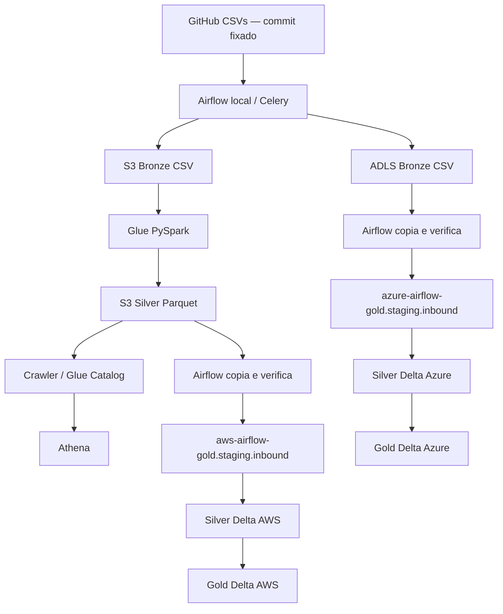

# Arquitetura e decisões

## Por que existe a cópia

A adaptação aprovada usa um workspace Free Edition. Não presume external locations,
storage credentials, APIs administrativas de conta ou leitura Spark direta do ADLS.
Airflow autentica nas clouds e transfere arquivos para volumes. Databricks acessa
somente seus volumes/tabelas. Isso adiciona transferência e latência, mas evita
colocar credenciais AWS/Azure em notebooks.

Cada catálogo tem schemas `staging`, `silver`, `gold`. Arquivos entram em
`staging.inbound`; as tabelas Delta ficam fora dos volumes. A Bronze autoritativa
é CSV nas contas S3/ADLS. Silver AWS usa Parquet para compartilhar a saída entre
Athena e a ponte, sem copiar um transaction log Delta manualmente.

## Contratos reais

Reservas: booking_id, passenger_id, flight_id, airport_id, amount, booking_date.
Passageiros: passenger_id, name, gender, nationality.
Aeroportos: airport_id, airport_name, city, country.

As chaves são strings, amount vira decimal(18,2), datas viram date. Campos vazios
viram nulos. Duplicatas idênticas são removidas; conflitos na mesma chave falham.
IDs de reservas, referências, data e valor são obrigatórios; valores negativos falham.
Nomes/dados descritivos podem ser nulos. Left joins preservam reservas cuja dimensão
esteja ausente, com flags passenger_found/airport_found e contagens de qualidade.

Gold `bookings_daily_airport`: por load_date, booking_date e aeroporto, contém
total_bookings, distinct_passengers, distinct_flights, total_amount, average_amount
e localização do aeroporto. A fonte não informa moeda nem aeroporto origem/destino.
Contagens distintas não são aditivas entre grupos.

## Fonte e idempotência

Commit fixado: `42efa594aaf3ef5b24877c7b61f1c1d7abc280cc` do repositório
[anshlambagit/ApacheAirflow](https://github.com/anshlambagit/ApacheAirflow).
Alterar a revisão exige revisar contratos e usar uma nova load_date.

Bronze: `bronze/load_date=AAAA-MM-DD/<dataset>/<dataset>.csv` no S3;
no ADLS, `bronze` é o filesystem. Manifestos registram revisão, tamanho, hash e linhas.
Glue escreve uma tentativa isolada; o caminho só segue adiante após SUCCEEDED.
O crawler consulta apenas o snapshot atual; Athena não oferece histórico de todas
as cargas nesta versão. Arquivos antigos não devem ser somados às tentativas atuais.

Volumes usam diretório UUID por transferência; manifesto é publicado por último.
O job verifica novamente os hashes antes da leitura. Delta replaceWhere substitui
somente load_date, em um commit, preservando outras cargas. Uma DAG ativa por vez
evita disputa no crawler. Também não execute os jobs manualmente em paralelo à DAG.

Gold armazena snapshots. Power BI deve selecionar uma carga, normalmente a mais
recente; somar todas as cargas repetiria reservas do mesmo CSV.

Referências: [Free Edition](https://docs.databricks.com/aws/en/getting-started/free-edition-limitations),
[volumes](https://docs.databricks.com/aws/en/volumes/volume-files),
[Airflow Compose](https://airflow.apache.org/docs/apache-airflow/3.3.1/howto/docker-compose/index.html).
